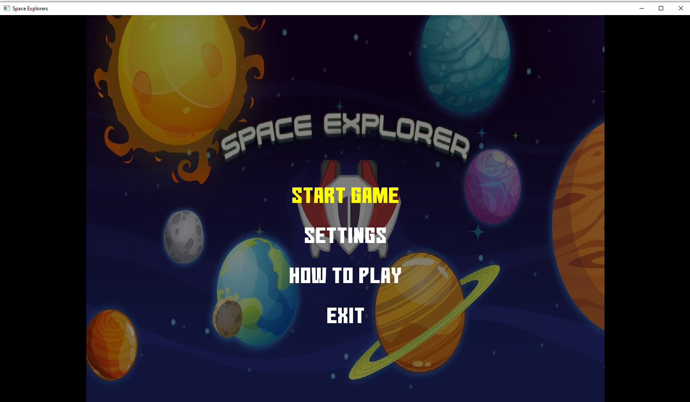

# INF1009 P8 Team 2 OOP Project  

# Space Explorers

**Space Explorers** is an exciting game where you navigate a spaceship through our solar system, exploring eight planets while avoiding satellites. Colliding with a satellite decreases health, but hitting asteroids triggers mini-games that can boost your score.

**DISCLAIMER**: This game is a demo and hence only have 1 planet and 1 mini game.

## How to Play

Run the `MyGdxGame` class to start the game. Use the arrow keys or WASD keys to move the spaceship. 
In the minigame, use your cursor to match the scattered pieces of the satellite to increase your score or lose your health if you don't complete it in time!

Press the Escape key to return to the main menu.

## Game Components

The game is built using Java and the [LibGDX](https://libgdx.badlogicgames.com/) game development framework. It consists of several key components:

- **MyGdxGame**: The main class of the game where the main components are initialized and managed.
- **GameScreen**: Represents a screen in the game where the gameplay happens. It creates and manages various entities in the game, including satellites and asteroids.
- **PlayerControlManager**: Responsible for handling player inputs and controlling the player's spaceship.
- **AIControlManager**: Controls the movement of non-player entities such as asteroids and satellites.
- **EntityManager**: Manages all entities in the game, including their creation, movement, rendering, and collision detection.
- **Satellite, Asteroid, Planet, and Spaceship**: These classes represent different entities in the game, each with properties and methods related to its appearance and behavior.
- **SatelliteTextureFactory**: A factory class responsible for creating and returning Texture objects for satellites.

## Development

The game is developed using IntelliJ IDEA 2023.3.4. The project uses Gradle for dependency management.

## Troubleshooting

If there are any unforeseen errors, try rebuilding the project.

## Game Engine Design

The game engine design demonstrates several key concepts in object-oriented programming:

- The Satellite, Asteroid, Planet, and Spaceship classes demonstrate **inheritance**, as they all extend the `Entity` class.
- The `EntityManager` class demonstrates **polymorphism** and **abstraction**. It manages all entities in the game, regardless of their specific types.
- The `AIControlManager` and `PlayerControlManager` classes demonstrate **encapsulation**. They each encapsulate the logic for controlling different types of entities.
- The `SatelliteTextureFactory` class demonstrates the **factory design pattern**. It is responsible for creating and returning Texture objects for satellites.

Enjoy exploring space with **Space Explorers**!